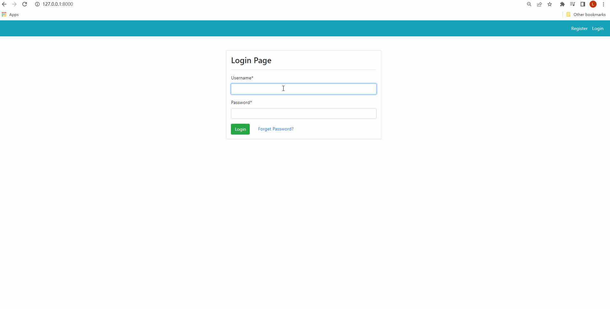

# Project - *Inventory_Tracking_Web_Application*

**Inventory_Tracking_Web_Application** is an web application using Django's URL routing and Python in the back-end.

Submitted by: **Zhengrui Lu**

Time spent: **60** hours spent in total

## User Stories

The following **required** functionality is completed:

* [X] Built a full stack application for inventory management in **Django** and **Python**, including dashboard and user apps.  
* [X] Built an interface using **bootstrap** 4.6, integrated with **Chart.js** for data visualization
* [X] Implemented the CRUD functionalities of a **database-driven** application, mainly with One-To-One and Foreign Key relationships.

## Video Walkthrough

Here's a walkthrough of implemented user stories:

GIF created with [LiceCap](http://www.cockos.com/licecap/).

## Notes

Describe any challenges encountered while building the app.

* [X] Understand throughly about the whole development process of Django web application project
* [ ] Deploy the application onto AWS(Elastic Beanstalk) 
* [ ] When deleting, allow deletion comments and undeletion
* [ ] Ability to create warehouses/locations and assign inventory to specific locations
* [ ] Ability to create “shipments” and assign inventory to the shipment, and adjust inventory appropriately

## License

    Copyright [yyyy] [name of copyright owner]

    Licensed under the Apache License, Version 2.0 (the "License");
    you may not use this file except in compliance with the License.
    You may obtain a copy of the License at

        http://www.apache.org/licenses/LICENSE-2.0

    Unless required by applicable law or agreed to in writing, software
    distributed under the License is distributed on an "AS IS" BASIS,
    WITHOUT WARRANTIES OR CONDITIONS OF ANY KIND, either express or implied.
    See the License for the specific language governing permissions and
    limitations under the License.
